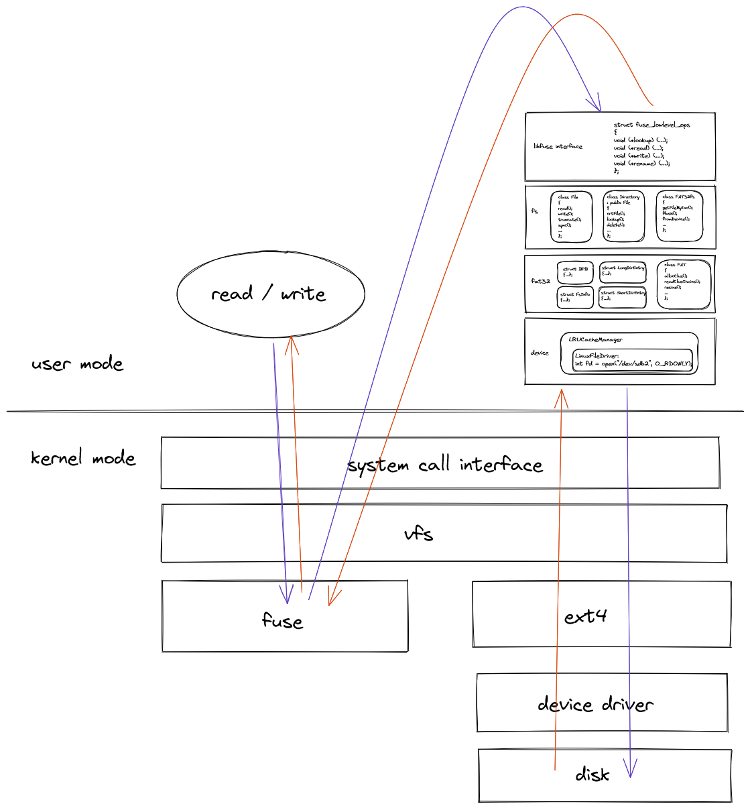

# fuse-fat32

**fuse-fat32** is a userspace fat32 (toy) driver using [libfuse](https://github.com/libfuse/libfuse) under linux.


### Build

requirement: 

- iconv is expected to be installed.

compile:

```bash
git submodule init
git submodule update
mkdir build
cd build
cmake ..
make all
```


### Usage

run `./fat32_fuse --help` to print help message:

```
usage: ./fat32_fuse --device-path=string --mountpoint=string [options] ... 
options:
  -d, --debug          enable debug mode
  -f, --foreground     foreground operation
  -p, --device-path    the path to the device (string)
  -m, --mountpoint     the mountpoint (string)
  -?, --help           print this message
```

To create a fake fat32 deivce and use **fat32_fuse** to drive it:

```bash
dd if=/dev/zero of=/tmp/fake_blk_dev bs=1024 count=1024k
mkfs.fat /tmp/fake_blk_dev
mkdir /home/las/mnt_point
./fat32_fuse -f -p /tmp/fake_blk_dev -m /home/las/mnt_point
```

Or you can run **fat32_fuse** to drive a real device:

```bash
mkdir mnt_point
sudo ./fat32_fuse -f -p /dev/sdc -m mnt_point
```


### About

architecture:


workflow:




